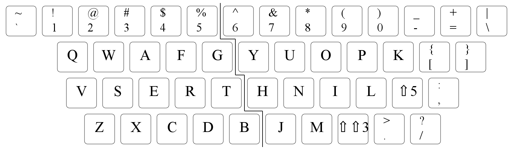
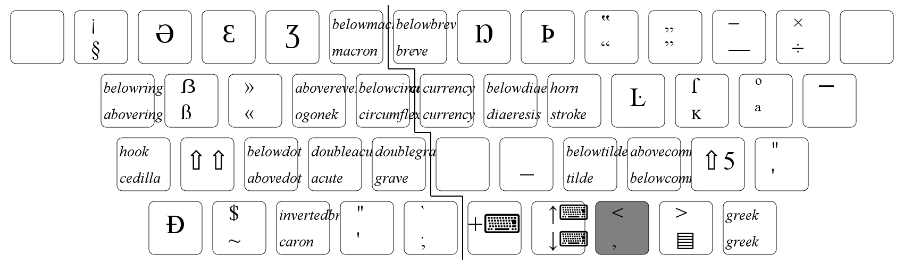
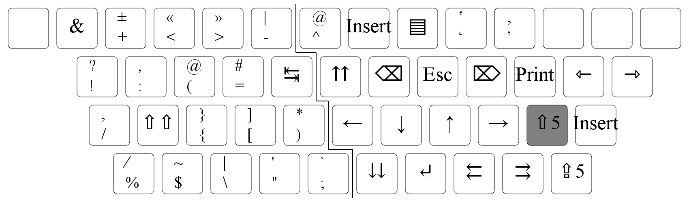
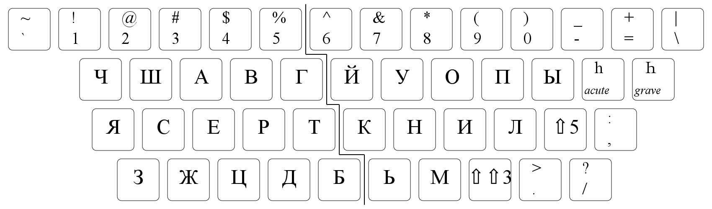
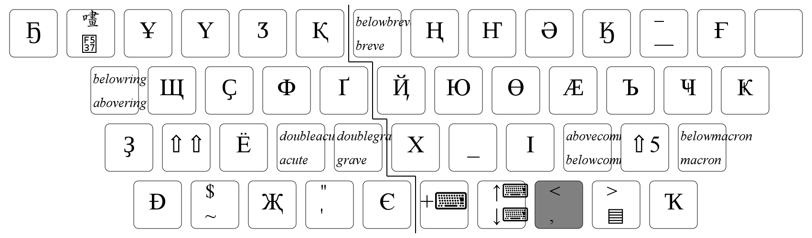

QWAF
====

Keyboard layout trying to be similar to Qwerty.
Works in X11, Wayland, Linux console.

The `hjkl` "module" makes `,` a prefix, `;` a modifier,
`,m` a layout switcher, and `,n` a Compose key.

  

AltGr level, accesible with Comma:
  

Second AltGr level, accessible with Semicolon:
  

Cyrillic variant:
  
  

International/Dvorak/etc. variants almost aren't tested.

Building
--------
Run:
```
make
```
It will download X11 files into `fetch/`, and generate layouts into `gen/`.

Bugs
----
The `,` and `;` modifiers sometimes lock. To recover, press them and `Shift` in
random combinations.

Running in X11 (i.e. XKB)
-------------------------
```sh
make
./examples/run_xkb_example.sh
./examples/run_example.sh 1
```
(Ignore the error and lots of warnings it would give).

If `;` does not become a modifier, perform a VT switch (e.g. via `Ctrl-Alt-F[1-9]`).

Or assemble an `.xkb` file (like `examples/qwaf_hjkl.xkb`), and run:
```sh
xkbcomp -I"/path/to/qwaf"/gen/xkb /path/to/xkb/file $DISPLAY
```

To install (for the current user), put the above in a file, like `~/xkb.sh`
and add the `sh ~/xkb.sh` to autostart
(by putting this into `~/.xinitrc`, or tweaking desktop settings).

Running in Linux console
------------------------
```sh
make
sudo loadkeys gen/linux_console/qwaf_us.map
```
Note: to see Compose combinations, run `dumpkeys | grep --binary-files=text ^compose`

Running under Weston
--------------------
- Symlink the generated files into `~/.xkb` with `make homeinstall`.
- Put into `~/.config/weston.ini`:
```
[keyboard]
keymap_rules=evdev_qwaf
keymap_layout=qwaf_layouts
keymap_variant=qwaf
```
  The `keymap_variant` corresponds to 'symbols' in the `layouts` source file.
  That is, `grep symbols layouts` gives list of possible values.
- Run `weston-launch` at VT console; quit by pressing `Ctrl-Alt-Backspace`

Other Wayland compositors probably require similar tweaks to their config files.

It is possible to use CapsLock or Right Alt as a locking `;` modifier.
For this, put an `option` value from `rules` file into `keymap_options`, such as:
```
[keyboard]
...
keymap_options=level5_caps_lock
```

Otherwise, CapsLock-as-a-Control is recommended:
```
keymap_options=ctrl:nocaps
```
